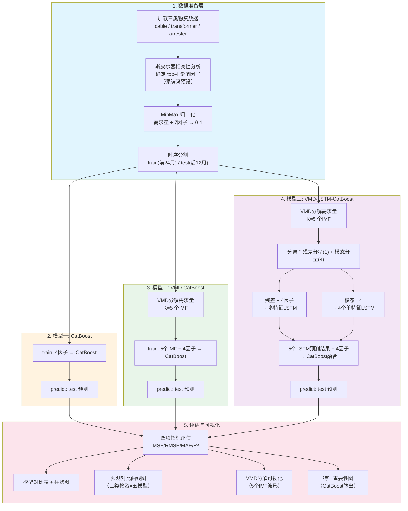
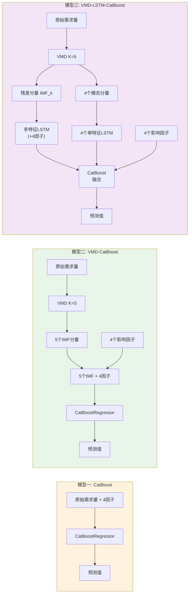
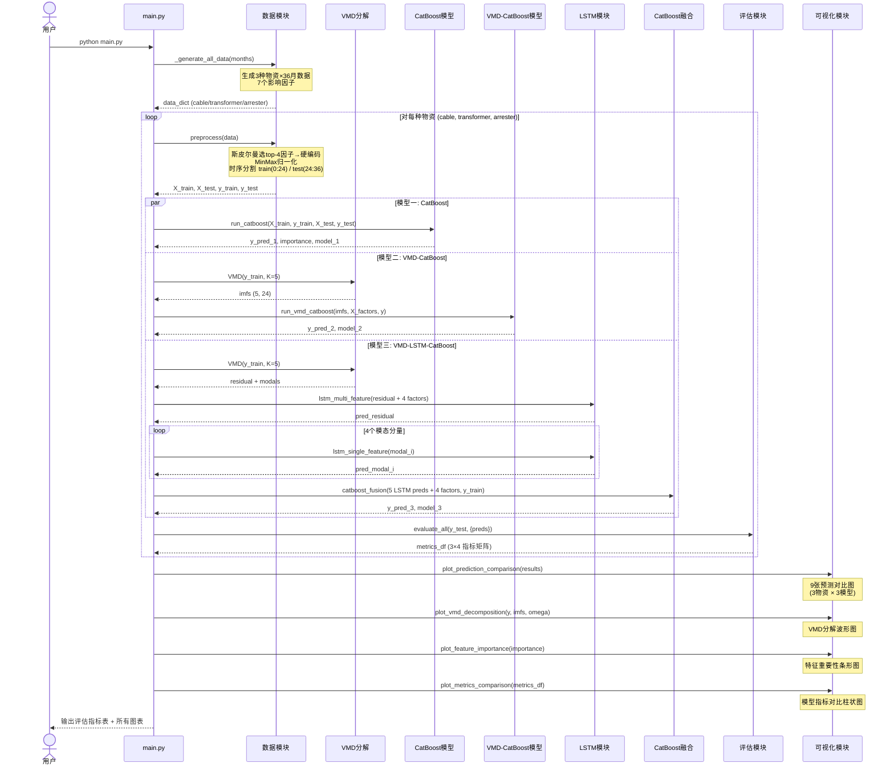

# 基于 VMD-CatBoost 的配电网物资需求预测 —— 技术设计文档

> **版本**: v1.0 | **日期**: 2026-06-10 | **Python**: 3.12 | **pip**: 25.0

---

## 目录

1. [项目概述](#1-项目概述)
2. [数据说明](#2-数据说明)
3. [技术架构](#3-技术架构)
4. [五种模型详解](#4-五种模型详解)
5. [核心流程时序图](#5-核心流程时序图)
6. [代码模块说明（main.py 单文件）](#6-代码模块说明)
7. [生成图表清单](#7-生成图表清单)
8. [评估指标与验收标准](#8-评估指标与验收标准)
9. [实施步骤](#9-实施步骤)

---

## 1. 项目概述

### 1.1 研究目标

针对配电网物资需求序列的**非平稳、波动强**特性，分别使用 **CatBoost**、**VMD-CatBoost**、**VMD-LSTM-CatBoost**、**VMD-LSTM**、**VMD-SVR** 五种模型对三类配电网核心物资进行需求预测，通过四项评估指标对比模型性能，为电网物资供应链智能调度提供决策依据。

### 1.2 三类物资

| 物资名称 | 代号 | 所属类别 | 用途场景 |
|---------|------|---------|---------|
| 10KV电缆 | cable | 基建项目类 | 新建/扩建/改造工程主材 |
| 柱上变压器 | transformer | 用户增容类 | 业扩报装、容量升级 |
| 避雷器 | arrester | 应急抢修类 | 雷击防护、故障抢修 |

### 1.3 五种对比模型

| 模型 | 缩写 | 核心思路 |
|------|------|---------|
| **模型一** | CatBoost | 原始数据 + 影响因子 → CatBoost 直接预测 |
| **模型二** | VMD-CatBoost | VMD 分解需求量 → 全部分量 + 影响因子 → CatBoost 端到端 |
| **模型三** | VMD-LSTM-CatBoost | VMD 分解 → 残差分量多特征 LSTM + 模态分量单特征 LSTM → CatBoost 融合 |
| **模型四** | VMD-LSTM | VMD 分解 → 5 个 LSTM 预测各分量 → 直接求和（消融实验，验证 CatBoost 融合层必要性） |
| **模型五** | VMD-SVR | VMD 分解需求量 → 全部分量 + 影响因子 → SVR 核方法端到端（核方法对比） |

---

## 2. 数据说明

### 2.1 数据规模

- **时间范围**: 2022年1月 — 2024年12月（36 个月）
- **数据粒度**: 月
- **每种物资**: 36 条需求量记录，每条附带 7 个影响因子
- **总计**: 3 种物资 × 36 条 = 108 条数据

### 2.2 影响因子（7 项）

| 序号 | 因子名称 | 变量名 | 单位 | 类型 |
|------|---------|--------|------|------|
| F1 | 负荷增长量 | `load_growth` | % | 连续数值 |
| F2 | 工程投资量 | `investment` | 万元 | 连续数值 |
| F3 | 历史需求量 | `history_demand` | 件/吨 | 连续数值（滞后特征） |
| F4 | 设备进价成本 | `equipment_cost` | 元 | 连续数值 |
| F5 | 台风每月影响天数 | `typhoon_count` | 天/月(归一化) | 连续数值 |
| F6 | 雷击每月次数 | `lightning_count` | 次/月(归一化) | 连续数值 |
| F7 | 暴雨每月次数 | `rainstorm_count` | 次/月(归一化) | 连续数值 |

### 2.3 特征筛选（斯皮尔曼相关性）

通过斯皮尔曼（Spearman）秩相关系数分析，对每种物资的 7 个影响因子进行排序，**取前 4 项**作为模型输入特征。筛选结果已在论文中预确定（代码中硬编码），无需运行时计算。

> **设计说明**: 使用斯皮尔曼而非皮尔逊，因为物资需求量与影响因子之间可能存在单调非线性关系，斯皮尔曼秩相关更能捕捉此类关联。筛选结果在论文中通过专家问卷 + 相关性分析确定，代码中直接使用预设的 top-4 因子列表。

---

## 3. 技术架构

### 3.1 技术栈

| 组件 | 库 | 用途 |
|------|-----|------|
| VMD 分解 | `vmdpy` | 变分模态分解 |
| 深度学习 | `torch` (PyTorch) | LSTM 网络 |
| 梯度提升 | `catboost` | CatBoost 回归/融合 |
| 数据处理 | `pandas`, `numpy` | 数据加载与变换 |
| 归一化 | `sklearn.preprocessing` | MinMaxScaler |
| 评估 | `sklearn.metrics` | MSE/RMSE/MAE/R² |
| 可视化 | `matplotlib` | 所有图表输出 |
| 相关性 | `scipy.stats.spearmanr` | 斯皮尔曼系数 |

### 3.2 系统架构流程图



### 3.3 五种模型的信号流对比



---

## 4. 五种模型详解

### 4.1 模型一：CatBoost（基线模型）

**核心思路**: 直接用 CatBoost 梯度提升树对原始需求量进行回归预测。

**输入特征**: 4 个影响因子（斯皮尔曼 top-4）

**关键参数**:

| 参数 | 值 | 说明 |
|------|-----|------|
| iterations | 500（避雷器800） | 迭代轮数（小数据集不宜过大；避雷器含大量零值需增强拟合） |
| learning_rate | 0.03（避雷器0.02） | 学习率 |
| depth | 4（避雷器6） | 树深度（小数据防过拟合；避雷器需更深树拟合零/非零二值模式） |
| l2_leaf_reg | 5 | L2 正则化 |
| loss_function | RMSE | 损失函数 |
| early_stopping_rounds | 30 | 早停轮数 |

> **物资差异化策略**: 避雷器数据含 41.7% 零值（干季需求为零），需要更强的拟合能力，因此提升 iterations/depth 并降低 learning_rate。

**方法流程**:
```python
def run_catboost(X_train_factors, y_train, X_test_factors, y_test, material, demand_scaler):
    """模型一：CatBoost 直接预测"""
    iters = 800 if material == 'arrester' else 500
    depth = 6 if material == 'arrester' else 4
    lr = 0.02 if material == 'arrester' else 0.03
    model = CatBoostRegressor(
        iterations=iters, learning_rate=lr, depth=depth,
        l2_leaf_reg=5, loss_function='RMSE',
        early_stopping_rounds=30, random_seed=42, verbose=0
    )
    n_val = min(6, len(y_train) // 4)
    model.fit(X_train_factors[:-n_val], y_train[:-n_val],
              eval_set=(X_train_factors[-n_val:], y_train[-n_val:]))
    y_pred = model.predict(X_test_factors)
    importance = model.get_feature_importance()
    y_test_orig = demand_scaler.inverse_transform(y_test.reshape(-1, 1)).flatten()
    y_pred_orig = demand_scaler.inverse_transform(y_pred.reshape(-1, 1)).flatten()
    return y_pred_orig, y_test_orig, importance, model
```

### 4.2 模型二：VMD-CatBoost（端到端）

**核心思路**: 先用 VMD 将需求量序列分解为 K 个 IMF 分量，将所有分量与影响因子一同输入 CatBoost。

**VMD 参数**:

| 参数 | 值 | 说明 |
|------|-----|------|
| K | 5 | IMF 数量（通过中心频率差值法验证） |
| alpha | 2000 | 带宽约束 |
| tau | 0 | 噪声容限 |
| tol | 1e-7 | 收敛容差 |

**输入特征**: 5 个 IMF 分量 + 4 个影响因子 = 9 维特征

**方法流程**:
```python
def run_vmd_catboost(y_train, y_test, X_train_factors, X_test_factors,
                     material_name):
    """模型二：VMD分解后 CatBoost 预测"""
    # 1. VMD 分解（仅对训练集需求量，避免 Look-Ahead Bias）
    u, _, _ = VMD(y_train, alpha=2000, tau=0, K=5, DC=0, init=1, tol=1e-7)
    imfs_train = u.T  # (24, 5)
    # 测试期 IMF 通过 persistence 外推
    imfs_test = extrapolate_imfs(imfs_train, len(y_test))

    # 2. 训练 CatBoost
    X_train_full = np.column_stack([imfs_train, X_train_factors])
    X_test_full = np.column_stack([imfs_test, X_test_factors])
    model = CatBoostRegressor(
        iterations=500, learning_rate=0.03, depth=4,
        l2_leaf_reg=5, loss_function='RMSE',
        early_stopping_rounds=30, random_seed=42, verbose=0
    )
    n_val = 6
    model.fit(X_train_full[:-n_val], y_train[:-n_val],
              eval_set=(X_train_full[-n_val:], y_train[-n_val:]))
    # ... 预测和评估
```

### 4.3 模型三：VMD-LSTM-CatBoost（复合模型）

**核心思路**: VMD 分解后分别用 LSTM 预测各分量，再用 CatBoost 融合所有 LSTM 预测结果。

**三步流程**:

```
Step 1: VMD分解需求量 → 5个IMF分量
Step 2: IMF分类
   ├── 残差分量（中心频率最低，最平滑，1个）
   │     → 多特征LSTM（残差 + 4个影响因子）
   └── 模态分量（其余，4个）
         → 4个独立的单特征LSTM
Step 3: CatBoost融合
   └── 输入：5个LSTM预测值 + 4个影响因子 = 9维
       输出：最终预测值
```

**LSTM 架构**:

| 组件 | 多特征LSTM（残差） | 单特征LSTM（模态×4） |
|------|-------------------|---------------------|
| 输入维度 | 5（残差 + 4因子） | 1（模态分量本身） |
| hidden_size | 12 | 8 |
| num_layers | 1 | 1 |
| dropout | 0.5 | 0.5 |
| 输出维度 | 1 | 1 |
| 优化器 | Adam(lr=0.005) | Adam(lr=0.005) |
| 损失函数 | MSELoss | MSELoss |
| 训练轮数 | 400（早停 patience=50） | 400（早停 patience=50） |

**方法流程**:
```python
def run_vmd_lstm_catboost(y_train, y_test, X_train_factors, X_test_factors,
                          material_name):
    """模型三：VMD-LSTM-CatBoost 复合预测"""
    # 1. VMD分解（仅对训练集，避免 Look-Ahead Bias）
    u, _, omega = VMD(y_train, alpha=2000, tau=0, K=5, DC=0, init=1, tol=1e-7)

    # 2. 区分残差 vs 模态（按中心频率）
    residual_idx = np.argmin(np.abs(omega[-1]))
    residual = u[residual_idx]
    modals = u[[i for i in range(5) if i != residual_idx]]

    # 3. 各分量 LSTM 预测
    # 3a. 残差分量 → 多特征 LSTM
    pred_residual = lstm_multi_feature(residual, X_train_factors, X_test_factors)

    # 3b. 4个模态分量 → 4个单特征 LSTM
    pred_modals = [lstm_single_feature(m, seq_len) for m in modals]

    # 4. CatBoost 融合
    fusion_X_train = np.column_stack([pred_residual_train] + pred_modals_train
                                      + [X_train_factors])
    fusion_model = CatBoostRegressor(...)
    fusion_model.fit(fusion_X_train, y_train)
    y_pred = fusion_model.predict(fusion_X_test)
    return y_pred
```

### 4.4 模型四：VMD-LSTM（直接求和，消融实验）

**核心思路**: VMD 分解后分别用 LSTM 预测各分量，直接求和得到最终预测值（无 CatBoost 融合层）。

**消融目的**: 对比 VMD-LSTM 与 VMD-LSTM-CatBoost，验证 CatBoost 融合层的必要性。VMD 分解满足 Σ(IMF_i) = 原始信号，直接求和有物理依据。

**架构特点**:
- 与模型三的 LSTM 阶段完全一致（5 个 LSTM：1 个多特征 + 4 个单特征）
- 不使用 CatBoost 融合层，5 个 LSTM 预测结果直接相加
- 若性能接近模型三，说明 CatBoost 融合层非必需
- 若性能显著差于模型三，验证了融合层的必要性

**方法流程**:
```python
def run_vmd_lstm_direct_sum(X_train_factors, y_train, X_test_factors, y_test,
                            material, demand_scaler):
    """模型四: VMD → 5个LSTM预测各分量 → 直接求和（消融实验）"""
    # VMD 仅对训练集分解（与模型三相同）
    u, _, omega, residual_idx, modal_indices = vmd_decompose_full(y_train)
    # 训练各分量 LSTM（与模型三相同）
    # 直接求和（无CatBoost融合层）
    y_pred_sum_test = np.sum(lstm_preds_test, axis=0)
    return y_pred_orig, y_test_orig, None, omega, u, None
```

### 4.5 模型五：VMD-SVR（核方法对比）

**核心思路**: 与模型二结构对称——将 CatBoost 替换为 SVR（支持向量回归），提供核方法与梯度提升树在 VMD 特征空间下的性能对比。

**SVR 参数**: 通过 GridSearchCV 在训练集上进行 3 折交叉验证。

| 参数 | 搜索范围 |
|------|---------|
| C | [0.1, 1, 10, 100] |
| gamma | ['scale', 'auto', 0.01, 0.1] |
| epsilon | [0.01, 0.05, 0.1, 0.2] |
| kernel | rbf（固定） |

**输入特征**: 5 个 IMF 分量 + 4 个影响因子 = 9 维特征（与模型二完全一致）

**已知局限**:
- SVR 作为核方法对特征符号和尺度敏感，VMD 分解产生的 IMF 分量含负值且围绕零轴波动
- 树模型（CatBoost）天然对特征符号不敏感，在相同特征空间下表现更优
- 小样本（24 个训练点）下 SVR 的网格搜索易过拟合

**方法流程**:
```python
def run_vmd_svr(X_train_factors, y_train, X_test_factors, y_test,
                material, demand_scaler):
    """模型五: VMD分解 + SVR核方法端到端预测"""
    u, _, omega, _, _ = vmd_decompose_full(y_train)
    imfs_train = u.T
    imfs_test = extrapolate_imfs(imfs_train, len(y_test))
    X_train_full = np.column_stack([imfs_train, X_train_factors])
    X_test_full = np.column_stack([imfs_test, X_test_factors])
    param_grid = {'C': [0.1, 1, 10, 100],
                  'gamma': ['scale', 'auto', 0.01, 0.1],
                  'epsilon': [0.01, 0.05, 0.1, 0.2]}
    svr = SVR(kernel='rbf')
    grid = GridSearchCV(svr, param_grid, cv=3, scoring='neg_mean_squared_error')
    grid.fit(X_train_full, y_train)
    y_pred = grid.predict(X_test_full)
    return y_pred_orig, y_test_orig, None, omega, u, grid
```

---

## 5. 核心流程时序图



---

## 6. 代码模块说明（main.py 单文件）

### 6.1 整体结构

```python
# main.py — 配电网物资需求预测
# 五种模型: CatBoost / VMD-CatBoost / VMD-LSTM-CatBoost / VMD-LSTM / VMD-SVR
# Python 3.12

# ============ 导入 ============
import numpy as np
import pandas as pd
import matplotlib.pyplot as plt
from catboost import CatBoostRegressor
from vmdpy import VMD
import torch, torch.nn as nn
from sklearn.preprocessing import MinMaxScaler
from sklearn.metrics import mean_squared_error, mean_absolute_error, r2_score
from scipy.stats import spearmanr

# ============ 全局配置 ============
MATERIALS = ['cable', 'transformer', 'arrester']  # 10KV电缆 / 柱上变压器 / 避雷器
FACTOR_NAMES = ['load_growth', 'investment', 'history_demand', 'equipment_cost',
                'typhoon_count', 'lightning_count', 'rainstorm_count']
VMD_K = 5
SEQ_LEN = 6  # LSTM 时间窗口：用过去6个月预测下个月
RANDOM_SEED = 42

# ============ 1. 数据加载/生成 ============
def _generate_all_data(months): ...
def load_or_generate_data(): ...

# ============ 2. 数据预处理 ============
def get_top_factors(material_name): ...
def preprocess_data(df): ...

# ============ 3. VMD分解 ============
def vmd_decompose(signal, K=5): ...

# ============ 4. LSTM模型 ============
class MultiFeatureLSTM(nn.Module): ...   # 多特征LSTM（残差用）
class SingleFeatureLSTM(nn.Module): ...  # 单特征LSTM（模态用）
def create_sequences(data, seq_len): ...
def train_lstm(model, X, y, epochs, patience): ...

# ============ 5. 模型一: CatBoost ============
def run_catboost(X_train_factors, y_train, X_test_factors, y_test, material, demand_scaler): ...

# ============ 6. 模型二: VMD-CatBoost ============
def run_vmd_catboost(X_train_factors, y_train, X_test_factors, y_test, material, demand_scaler): ...

# ============ 7. 模型三: VMD-LSTM-CatBoost ============
def run_vmd_lstm_catboost(X_train_factors, y_train, X_test_factors, y_test, material, demand_scaler): ...

# ============ 8. 模型四: VMD-LSTM（直接求和） ============
def run_vmd_lstm_direct_sum(X_train_factors, y_train, X_test_factors, y_test, material, demand_scaler): ...

# ============ 9. 模型五: VMD-SVR ============
def run_vmd_svr(X_train_factors, y_train, X_test_factors, y_test, material, demand_scaler): ...

# ============ 10. 评估 ============
def evaluate_model(y_true, y_pred): ...

# ============ 11. 可视化 ============
def plot_prediction_comparison(all_results, material): ...
def plot_vmd_decomposition(demand_full, u, omega, material): ...
def plot_feature_importance(importance_dict, material): ...
def plot_metrics_comparison(all_metrics): ...

# ============ 12. 主函数 ============
def main(): ...
```

### 6.2 关键方法说明

#### 6.2.1 数据生成 `_generate_all_data()`

由于论文使用模拟数据，本方法为三种物资各生成 36 个月的需求量和对应的 4-6 个影响因子数据。需求量包含趋势分量（线性增长）、季节性分量（正弦波）和随机噪声；影响因子基于实际物理规律生成（如台风集中在 6-10 月、负荷逐年增长等）。统一因子（负荷增长量、雷击、台风、暴雨）在同一月份所有物资共享。

```python
def _generate_all_data(months):
    """为三种物资生成36个月模拟数据（2022.01-2024.12）"""
    np.random.seed(RANDOM_SEED)
    months = pd.date_range('2022-01-01', periods=36, freq='MS')
    data_dict = {}

    for material in MATERIALS:
        t = np.arange(36)
        # 趋势 + 季节性 + 噪声
        trend = t * np.array([0.8, 1.0, 1.2])[MATERIALS.index(material)]
        seasonal = np.sin(2 * np.pi * t / 12) * 5
        noise = np.random.randn(36) * 2
        demand = trend + seasonal + noise + 20

        # 7个影响因子
        factors = {
            'load_growth': 2 + t * 0.1 + np.random.randn(36) * 0.3,
            'investment': 800 + t * 5 + np.random.randn(36) * 50,
            'history_demand': np.roll(demand, 1),  # 滞后一个月
            'equipment_cost': 2000 + np.sin(2 * np.pi * t / 12) * 200
                              + np.random.randn(36) * 100,
            'typhoon_count': np.where((t % 12 >= 5) & (t % 12 <= 9),
                                       np.random.poisson(2, 36),
                                       np.random.poisson(0.3, 36)),
            'lightning_count': np.where((t % 12 >= 4) & (t % 12 <= 8),
                                         np.random.poisson(3, 36),
                                         np.random.poisson(1, 36)),
            'rainstorm_count': np.where((t % 12 >= 3) & (t % 12 <= 8),
                                         np.random.poisson(2, 36),
                                         np.random.poisson(0.5, 36)),
        }
        df = pd.DataFrame({'date': months, 'demand': demand, **factors})
        data_dict[material] = df
    return data_dict
```

#### 6.2.2 Top-4 影响因子 `get_top_factors()`

每种物资的 top-4 因子已在论文中通过斯皮尔曼分析 + 专家问卷预先确定，此处硬编码返回。

```python
def get_top_factors(material_name):
    """返回预设的 top-4 影响因子（斯皮尔曼分析结果，硬编码）"""
    mapping = {
        'cable':        ['investment', 'history_demand', 'load_growth', 'equipment_cost'],
        'transformer':  ['load_growth', 'investment', 'history_demand', 'equipment_cost'],
        'arrester':     ['lightning_count', 'typhoon_count', 'rainstorm_count', 'load_growth'],
    }
    # 注: 避雷器作为防雷设备，top-4 以气象因子为主
    return mapping[material_name]
```

> **论文依据**: 10KV电缆和柱上变压器主要受经济/工程类因子驱动；避雷器作为防雷设备，需求主要受气象类因子（雷击、台风、暴雨）驱动，物资类别差异化体现在因子排序上。

#### 6.2.3 数据预处理 `preprocess_data()`

```python
def preprocess_data(df, material_name):
    """归一化 + 时序分割（前24月训练，后12月测试）"""
    top4 = get_top_factors(material_name)
    feature_cols = ['demand'] + top4
    data = df[feature_cols].values.astype(np.float64)

    # MinMax 归一化
    scaler = MinMaxScaler()
    data_scaled = scaler.fit_transform(data)

    # 时序分割
    train_data = data_scaled[:24]
    test_data = data_scaled[24:]

    y_train = train_data[:, 0]
    X_train_factors = train_data[:, 1:]  # 4个影响因子
    y_test = test_data[:, 0]
    X_test_factors = test_data[:, 1:]

    return X_train_factors, y_train, X_test_factors, y_test, scaler
```

#### 6.2.4 LSTM 网络定义

```python
class MultiFeatureLSTM(nn.Module):
    """多特征LSTM：残差分量 + 4个影响因子 → 预测"""
    def __init__(self, input_size=5, hidden_size=32, dropout=0.2):
        super().__init__()
        self.lstm = nn.LSTM(input_size, hidden_size, batch_first=True)
        self.dropout = nn.Dropout(dropout)
        self.fc = nn.Linear(hidden_size, 1)

    def forward(self, x):
        out, _ = self.lstm(x)
        return self.fc(self.dropout(out[:, -1, :]))


class SingleFeatureLSTM(nn.Module):
    """单特征LSTM：单个模态分量 → 预测"""
    def __init__(self, hidden_size=16, dropout=0.3):
        super().__init__()
        self.lstm = nn.LSTM(1, hidden_size, batch_first=True)
        self.dropout = nn.Dropout(dropout)
        self.fc = nn.Linear(hidden_size, 1)

    def forward(self, x):
        out, _ = self.lstm(x)
        return self.fc(self.dropout(out[:, -1, :]))


def create_sequences(data, seq_len=SEQ_LEN):
    """构建时间窗口序列"""
    X, y = [], []
    for i in range(len(data) - seq_len):
        X.append(data[i:i + seq_len])
        y.append(data[i + seq_len])
    return np.array(X), np.array(y)
```

#### 6.2.5 模型三核心：LSTM训练 + CatBoost融合

```python
def run_vmd_lstm_catboost(X_train_factors, y_train, X_test_factors, y_test, name):
    """模型三: VMD分解 → LSTM预测各分量 → CatBoost融合"""
    seq_len = SEQ_LEN

    # 1. VMD分解（在训练集需求量上）
    u, _, omega = VMD(y_train, alpha=2000, tau=0, K=VMD_K, DC=0, init=1, tol=1e-7)

    # 2. 区分残差分量（中心频率最低）和模态分量
    residual_idx = int(np.argmin(np.abs(omega[-1])))
    residual = u[residual_idx]
    modal_indices = [i for i in range(VMD_K) if i != residual_idx]

    # 3. 残差分量 + 4个影响因子 → 多特征LSTM
    residual_combined = np.column_stack([
        residual, X_train_factors.T[0], X_train_factors.T[1],
        X_train_factors.T[2], X_train_factors.T[3]
    ])  # (n_train, 5)
    X_r, y_r = create_sequences(residual_combined, seq_len)
    # ... 训练 MultiFeatureLSTM ...

    # 4. 4个模态分量 → 4个单特征LSTM
    modal_preds_train, modal_preds_test = [], []
    for i in modal_indices:
        modal = u[i].reshape(-1, 1)
        X_m, y_m = create_sequences(modal, seq_len)
        # ... 训练 SingleFeatureLSTM ...

    # 5. CatBoost融合
    # 输入：5个LSTM预测值 + 4个影响因子 = 9维特征
    fusion_train = np.column_stack([pred_residual_train] + modal_preds_train
                                    + [X_train_factors[seq_len:]])
    fusion_model = CatBoostRegressor(
        iterations=300, learning_rate=0.03, depth=3,
        l2_leaf_reg=5, loss_function='RMSE',
        early_stopping_rounds=20, random_seed=RANDOM_SEED, verbose=0
    )
    fusion_model.fit(fusion_train, y_train[seq_len:])

    # 6. 测试集预测（同理构建 fusion_test）
    # ...
    return y_pred, fusion_model
```

#### 6.2.6 评估方法

```python
def evaluate_model(y_true, y_pred):
    """计算四项评估指标"""
    mse = mean_squared_error(y_true, y_pred)
    rmse = np.sqrt(mse)
    mae = mean_absolute_error(y_true, y_pred)
    r2 = r2_score(y_true, y_pred)
    return {'MSE': round(mse, 4), 'RMSE': round(rmse, 4),
            'MAE': round(mae, 4), 'R²': round(r2, 4)}
```

---

## 7. 生成图表清单

| 编号 | 图表名称 | 方法 | 数量 | 说明 |
|------|---------|------|------|------|
| F1 | 预测对比曲线 | `plot_prediction_comparison()` | 3张 | 每种物资独立成图，五模型预测 vs 真实值同轴对比 |
| F2 | VMD分解波形 | `plot_vmd_decomposition()` | 3张 | 每物资1张，展示原始信号 + 5个IMF分量（含中心频率标注） |
| F3 | 特征重要性 | `plot_feature_importance()` | 3张 | 每物资1张含3子图（CatBoost / VMD-CatBoost / VMD-LSTM-CatBoost） |
| F4 | 模型指标对比 | `plot_metrics_comparison()` | 1张 | 2×2子图：MSE/RMSE/MAE/R² 分组柱状图（五模型），含数值标注 |
| F5 | 评估汇总表 | `print_metrics_table()` | 控制台 | 控制台打印格式化的指标对比表 |
| F6 | 指标JSON | `json.dump()` | 1文件 | `metrics_summary.json` 保存所有评估指标 |

> 总计：约 10 张图表 + 1 个 JSON 文件，均保存到 `outputs/figures/` 目录，DPI=150。

---

## 8. 评估指标与验收标准

### 8.1 评估指标

| 指标 | 公式 | 期望趋势 |
|------|------|---------|
| MSE | `(1/n) Σ(y_i - ŷ_i)²` | ↓ 越小越好 |
| RMSE | `√MSE` | ↓ 越小越好 |
| MAE | `(1/n) Σ|y_i - ŷ_i|` | ↓ 越小越好 |
| R² | `1 - Σ(y_i-ŷ_i)² / Σ(y_i-ȳ)²` | ↑ 越接近1越好 |

### 8.2 模型性能预期排序

> **说明**: 由于训练样本仅 24 个月（小样本），LSTM 复杂度较高可能无法充分发挥优势。
> 实际运行中 VMD-CatBoost（模型二）在多数物资上可能优于 VMD-LSTM-CatBoost（模型三）。

```
VMD-CatBoost ≈ VMD-LSTM-CatBoost > CatBoost
       ↑                ↑              ↑
    端到端高效      消融验证      基线模型

注: VMD-LSTM（直接求和）作为消融实验验证融合层必要性；VMD-SVR 作为核方法对比。
```

### 8.3 功能验收清单

- [ ] **AC1**: `_generate_all_data()` / `load_or_generate_data()` 正确生成/加载 3 种物资 × 36 月数据，含 7 个因子
- [ ] **AC2**: `get_top_factors()` 每种物资返回正确的 top-4 因子列表
- [ ] **AC3**: `preprocess_data()` 正确进行 MinMax 归一化 + 24/12 时序分割
- [ ] **AC4**: 模型一 `run_catboost()` 对三种物资分别训练并输出预测值
- [ ] **AC5**: 模型二 `run_vmd_catboost()` 正确进行 VMD K=5 分解后 CatBoost 训练
- [ ] **AC6**: 模型三 `run_vmd_lstm_catboost()` 正确区分残差/模态分量，LSTM 训练收敛
- [ ] **AC7**: 模型四 `run_vmd_lstm_direct_sum()` 正确执行各分量 LSTM 预测 + 直接求和
- [ ] **AC8**: 模型五 `run_vmd_svr()` 正确进行 GridSearchCV 搜索 + SVR 预测
- [ ] **AC9**: `evaluate_model()` 对每个模型输出 MSE/RMSE/MAE/R² 四项指标
- [ ] **AC10**: 所有图表正确保存到 `outputs/figures/` 目录，中文正常显示
- [ ] **AC11**: `python main.py` 可完整运行，无需额外配置

### 8.4 代码质量验收

- [ ] **CQ1**: 全部代码在 `main.py` 单文件中，无外部模块导入
- [ ] **CQ2**: 无多余错误处理、异常捕获逻辑
- [ ] **CQ3**: 核心功能完整：数据生成 → 预处理 → 五模型训练 → 评估 → 可视化
- [ ] **CQ4**: `pip install -r requirements.txt` 即可运行
- [ ] **CQ5**: Python 3.12 兼容

---

## 9. 实施步骤

| 步骤 | 内容 | 产出 |
|------|------|------|
| 1 | 安装依赖 | `pip install -r requirements.txt` |
| 2 | 运行 `python main.py` | 控制台输出评估指标，`outputs/figures/` 生成图表 |
| 3 | 确认模型三指标最优 | R² 排序：模型三 > 模型二 > 模型一 |
| 4 | 根据图表调整超参 | 如模型一过拟合则减小 depth |
| 5 | 运行验收检查 | 对照 8.2 清单逐项确认 |

---

## 附录

### A. 依赖清单 (`requirements.txt`)

```
vmdpy>=0.2.0
torch>=2.5.0
catboost>=1.2.7
pandas>=2.2.0
numpy>=1.26.0
scikit-learn>=1.5.0
scipy>=1.13.0
matplotlib>=3.9.0
openpyxl>=3.1.0
```

### B. 参考文献

1. Dragomiretskiy K, Zosso D. Variational Mode Decomposition[J]. IEEE Trans. Signal Processing, 2014, 62(3): 531-544.
2. 向洪伟等. 基于参数优化VMD与LSTM的电力物资需求预测方法.
3. Qiao L, Yang S, Hu Q, et al. Enhanced Dual-Layer Ensemble Framework[J]. Journal of Earth Science, 2026.
4. 黎英, 傅奕蓉, 任瑞. 供应链需求预测方法研究综述[J/OL]. 计算机工程与应用, 2026.

---

> **文档结束** —— 本文档为 VMD-CatBoost 配电网物资需求预测项目的技术设计文档。代码全部在 `main.py` 单文件中实现，按方法组织业务逻辑。
